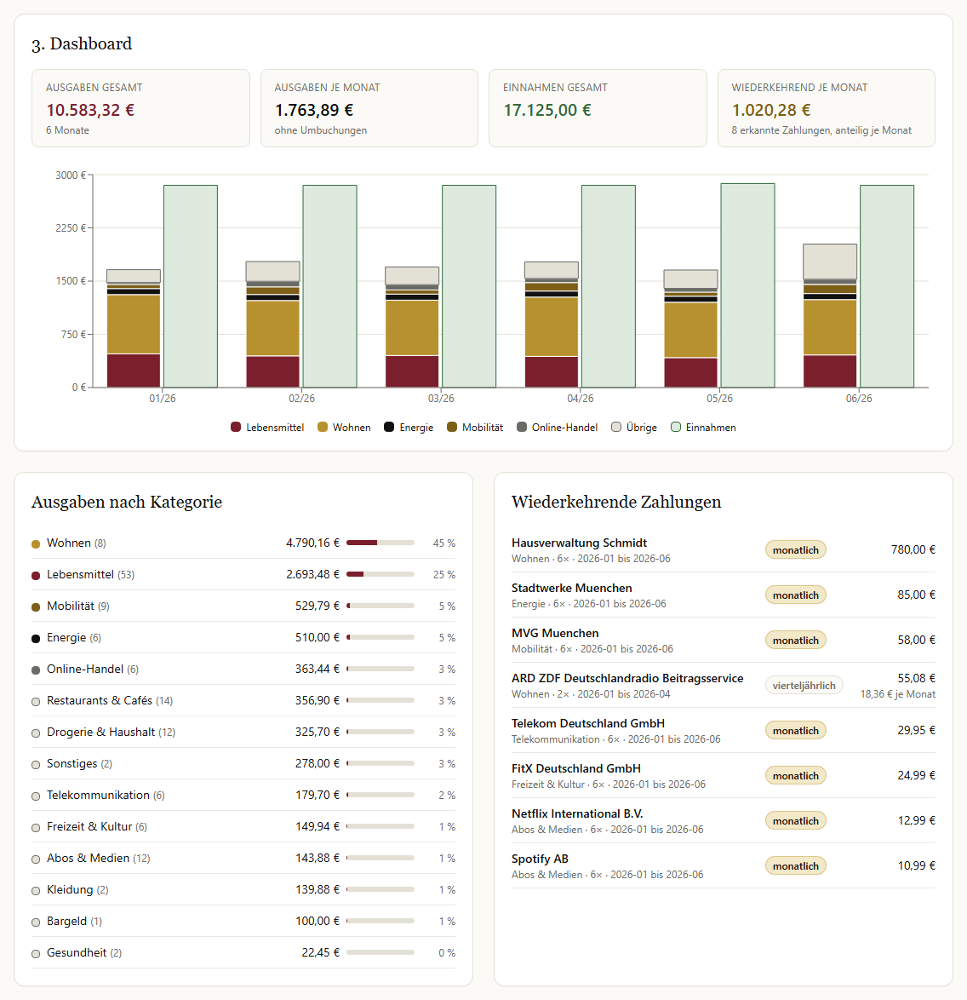
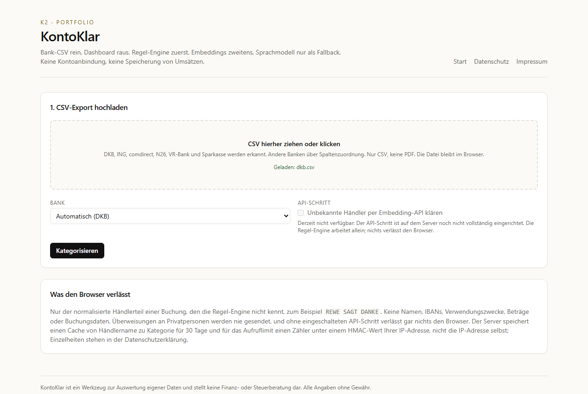
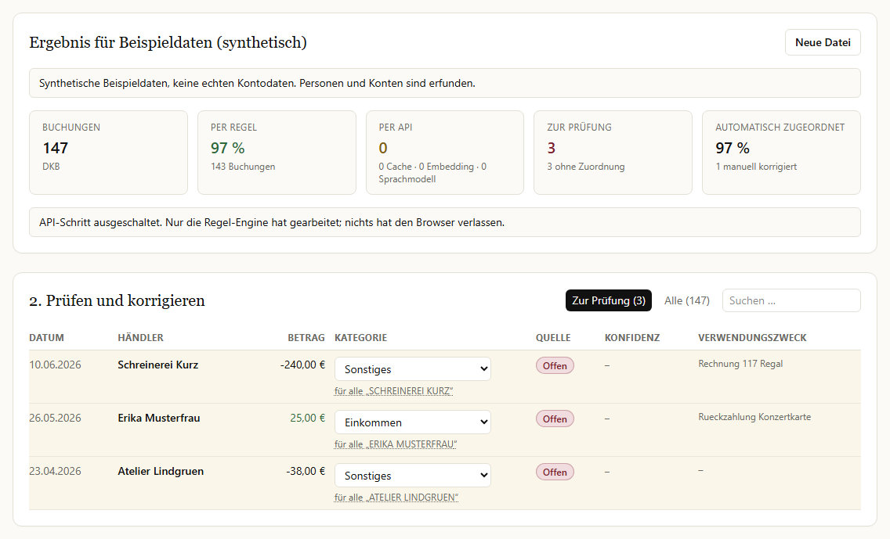
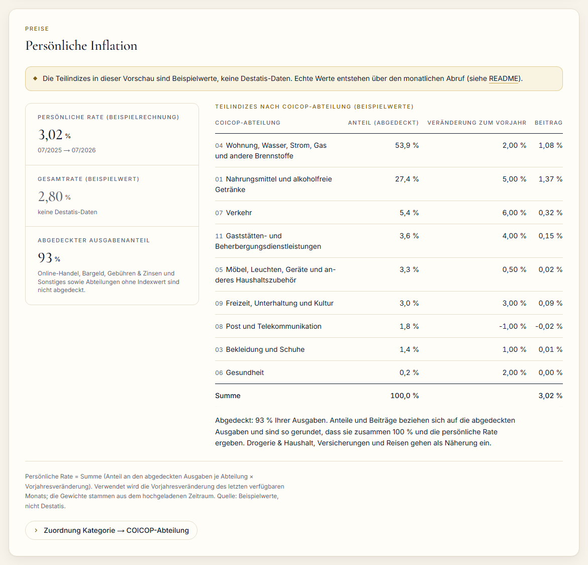

# KontoKlar

Kategorisiert Bankumsätze aus CSV-Exporten und zeigt, wohin das Geld geht. Regel-Engine zuerst, Embeddings zweitens, Sprachmodell nur als Fallback. Keine Kontoanbindung, keine Speicherung von Umsätzen.

[](https://github.com/mirkan-morgenfels-ai/kontoklar/actions/workflows/ci.yml)
[](./LICENSE)

Live-Demo: https://kontoklar-eight.vercel.app/projects/kontoklar



**English summary.** KontoKlar categorizes German bank account CSV exports (DKB, ING, comdirect, N26, VR-Bank in the new and old format, Sparkasse, plus a generic column mapping for other banks) and builds a household dashboard: monthly spending by category, recurring payments, and a personal inflation rate that weights consumer price sub-indices with the user's own spending shares. Categorization is a three-stage hybrid: a client-side rule engine, then OpenAI embeddings with k-nearest-neighbour voting against a labelled example set, then a small LLM only for low-confidence cases. Results are cached per merchant, requests are rate-limited (keyed by an HMAC of the client IP or, for IPv6, of its /64 prefix, never the raw IP) and bot-protected, so variable API cost stays near zero. The API route is fail-closed: unless the OpenAI key, Upstash Redis, Cloudflare Turnstile and the IP hashing secret are all configured, it answers 503 and never calls OpenAI. No transactions are stored server-side; with the optional API step, only cleaned merchant names of card payments, direct debits and transfers to recipients with a company marker leave the browser; never purposes (for PayPal only the merchant from "Ihr Einkauf bei …", and only if it carries a company marker), amounts, credits or transfers to recipients without a company marker.

Status: live with the in-browser rule engine; the embedding/LLM stage is implemented and tested with mocks but not enabled yet.
Measured on a 198-transaction synthetic test set: rules cover 96.5 % at 99.0 % accuracy (95.5 % overall, uncovered counted as wrong); the test set was built alongside the rules.

## Problem

Wer wissen will, wohin das Geld geht, hat bei deutschen Banken drei Wege: die Auswertung im Online-Banking der eigenen Bank (nur für dieses eine Konto und je nach Bank verschieden), Multibanking-Apps (sie verlangen Zugangsdaten und speichern Umsätze in der Cloud) oder eine Tabellenkalkulation (Handarbeit). KontoKlar arbeitet bankübergreifend mit dem CSV-Export, den jede Bank anbietet, braucht keine Zugangsdaten und wertet die Umsätze im Browser aus.

## Was KontoKlar macht

- Liest die Umsatz-CSV von DKB, ING, comdirect, N26, VR-Bank und Sparkasse ein; andere Banken über ein generisches Spalten-Mapping. PDF-Kontoauszüge werden nicht gelesen; die Oberfläche erklärt dann den Weg zum CSV-Export.
- Kategorisiert jede Buchung in drei Stufen: Regel-Engine, Embedding-Ähnlichkeit, Sprachmodell-Fallback.
- Zeigt jede automatische Zuordnung mit Konfidenz an; unsichere Fälle sind zur Prüfung markiert und lassen sich mit einem Klick korrigieren.
- Erkennt wiederkehrende Zahlungen (Abos, Miete, Versicherungen, Rundfunkbeitrag) über Rhythmus (monatlich, vierteljährlich, halbjährlich, jährlich) und Betrag und rechnet sie anteilig auf den Monat um.
- Berechnet eine persönliche Inflationsrate aus den eigenen Ausgabenanteilen und den Teilindizes des Verbraucherpreisindex (Destatis).
- Bietet synthetische Beispieldaten zum Ausprobieren (Schaltfläche „Mit Beispieldaten ausprobieren“, 147 Buchungen von Januar bis Juni 2026, Personen und Konten erfunden).
- Speichert keine Umsätze. Der Server kennt nur einen Cache von Händlername zu Kategorie.

## Screenshots

Aufgenommen mit Playwright bei 1280 px gegen `next start` (Produktions-Build, Design „Navy & Gold“ wie DepotDoktor und NetzRadar) mit den synthetischen Beispieldaten („Mit Beispieldaten ausprobieren“, Datei `packages/csv/fixtures/demo-synthetic.csv`). Der API-Schritt ist dabei nicht eingerichtet; es wurden keine Buchungsdaten gesendet (kein POST, nur der Statusabruf `GET /api/categorize`). Die Inflationswerte sind Beispielwerte, die Oberfläche kennzeichnet sie so.







## So funktioniert es

```
Bank-CSV (Browser) -> Papa Parse -> Normalisierung
  -> Regel-Engine (clientseitig; Ziel laut Plan etwa 70 % der Buchungen,
     auf dem synthetischen Testset 96,5 %)
  -> Rest: normalisierter Händlerteil -> ein Batch-Aufruf /api/categorize (nur wenn eingeschaltet)
       -> Konfiguration vollständig? sonst 503
       -> Beispielset vorhanden? sonst 503
       -> Body höchstens 200.000 Byte (Header und tatsächlich gelesene Bytes), sonst 413
       -> gültige Client-IP? sonst 503
       -> Turnstile prüfen -> Rate-Limit prüfen (HMAC-SHA256 der IP, bei IPv6 des /64-Präfixes, als Schlüssel;
          Upstash nicht erreichbar oder keine Antwort binnen 5 s: 503)
       -> Cache-Lookup (Upstash Redis)
       -> neue Texte: Embedding (text-embedding-3-small) + kNN gegen gelabeltes Beispielset
       -> Konfidenz < 0,5: Sprachmodell-Fallback (GPT-5 nano)
       -> Ergebnisse cachen (30 Tage)
  -> Review-Tabelle -> Dashboard
  -> persönliche Inflation aus data/k2/cpi.json
```

Konfidenzschwellen: Regel trifft → 1,0. Embedding-kNN ≥ 0,80 → übernehmen. 0,50 bis 0,80 → übernehmen und zur Prüfung markieren. Unter 0,50 → Sprachmodell entscheidet, Ergebnis wird mit 0,50 gecacht. kNN-Konfidenz = mittlere Kosinus-Ähnlichkeit der Nachbarn der Mehrheitskategorie (k = 3); ohne Mehrheit zusätzlich mit dem Gewichtsanteil multipliziert. Rechenbeispiel: zwei Nachbarn Lebensmittel (0,94 und 0,88), ein Nachbar Drogerie (0,71); die Konfidenz für Lebensmittel ist der Mittelwert 0,91.

Regeln mit dem Feld `merchant` prüfen den normalisierten Händlerteil und zusätzlich den Empfängernamen mit Ziffern, damit Muster wie „BLUME 2000“, „HUK24“ oder „CHECK24“ greifen. Ohne Regeltreffer bleibt eine Buchung offen: Ausgaben als „Sonstiges“, Eingänge als „Einkommen“, jeweils zur Prüfung markiert und ohne Konfidenzwert.

## Datenschutz: Was den Browser verlässt

Der API-Schritt ist standardmäßig aus und muss vor dem Upload angehakt werden; ohne ihn verlässt nichts den Browser.

Mit eingeschaltetem API-Schritt gesendet werden höchstens bereinigte Händlernamen von Kartenzahlungen und Lastschriften sowie von Überweisungen und sonstigen Abbuchungen an Empfänger mit Firmenkennzeichen (etwa GmbH, AG, Versicherung), und nur für Buchungen, die die Regel-Engine nicht kennt, zum Beispiel `REWE SAGT DANKE`. Die Normalisierung entfernt IBANs, BICs, Daten, Uhrzeiten, Nummern, SEPA-Kürzel, Zahlungsart-Wörter und Rechtsformen und kürzt auf 60 Zeichen. Bei PayPal wird der Händler aus „Ihr Einkauf bei …“ genommen, nicht der PayPal-Text, und nur gesendet, wenn er ein Firmenkennzeichen trägt.

Nicht gesendet werden: Gutschriften, Überweisungen an Empfänger ohne Firmenkennzeichen, PayPal-Einkäufe bei Verkäufern ohne Firmenkennzeichen (etwa Privatpersonen), Buchungen ohne lesbaren Empfängernamen, Verwendungszwecke, IBANs, Beträge, Buchungsdaten, Kontonummern und vollständige Buchungszeilen. Diese Buchungen bleiben zur Prüfung markiert. Die Erkennung ist regelbasiert (`isApiEligible` in `apps/web/lib/kontoklar/merchant.ts`); die Oberfläche zeigt nach jedem Upload die Liste der tatsächlich übertragenen Texte.

Serverseitig gespeichert werden ausschließlich ein Cache von normalisiertem Händlernamen zu Kategorie und Konfidenz (30 Tage) sowie der Zähler des Tageslimits. Den Zählerschlüssel bildet der Server als HMAC-SHA256 der IP-Adresse mit dem geheimen Server-Schlüssel `IP_HASH_SECRET`, bei IPv6 nur aus den ersten 64 Bit (alle Adressen eines /64-Netzes teilen sich ein Limit); die rohe IP geht nicht an Upstash. Upstash löscht jeden Zähler 48 Stunden und 1 Sekunde nach dem ersten Aufruf im jeweiligen Tagesfenster (Ablaufzeit der Bibliothek `@upstash/ratelimit`: zwei Fensterlängen plus 1 Sekunde). Für die Bot-Prüfung sendet der Server das Turnstile-Token und die IP-Adresse an Cloudflare. Umsätze werden nicht gespeichert. Für die Embedding- und Fallback-Aufrufe gelten die Datenverarbeitungsvereinbarungen des API-Anbieters; die Datenschutzerklärung der Seite nennt sie. Wer keine Übertragung möchte, lässt den API-Schritt aus; dann arbeitet nur die Regel-Engine.

## Kostenkontrolle

| Maßnahme | Wirkung |
|---|---|
| Regel-Engine clientseitig | Buchungen mit Regeltreffer kosten nichts (Planannahme etwa 70 %, auf dem synthetischen Testset 96,5 %) |
| Cache pro Händlername | jeder Händlertext kostet höchstens einmal |
| Ein Batch-Aufruf pro Upload, höchstens 500 Texte | wenige Function Invocations und Redis-Befehle |
| Embeddings statt Sprachmodell als Standard | 0,02 $ pro Mio. Token statt eines LLM-Aufrufs je Buchung |
| Sprachmodell nur unter Konfidenz 0,5 | Fallback nur für unsichere Fälle (Planannahme etwa 2 % der Buchungen, noch nicht gemessen) |
| Tageslimit 30 Aufrufe je IP-Hash, Cloudflare Turnstile | Schutz vor Skripten und Massenanfragen |
| Hartes Monatslimit an der Anbieter-Konsole | Kosten sind nach oben gedeckelt |

Die API-Route ist fail-closed. Der API-Schritt ist nur aktiv, wenn alle sechs Variablen gesetzt sind: `OPENAI_API_KEY`, `UPSTASH_REDIS_REST_URL`, `UPSTASH_REDIS_REST_TOKEN`, `TURNSTILE_SECRET_KEY`, `NEXT_PUBLIC_TURNSTILE_SITE_KEY` und `IP_HASH_SECRET` (mindestens 32 Zeichen). Fehlt eine davon, meldet `GET /api/categorize` `enabled: false` mit einer deutschen Begründung und der Liste der fehlenden Variablen (nie mit Werten), und `POST` antwortet mit 503, ohne OpenAI aufzurufen. Ebenfalls 503 gibt es ohne Beispielset, ohne gültige Client-IP in `x-real-ip`, `x-forwarded-for` oder `cf-connecting-ip` und wenn das Rate-Limit nicht erreichbar ist; als nicht erreichbar gilt auch eine Antwort, die nicht binnen 5 Sekunden eintrifft. In der Produktionsumgebung (`VERCEL_ENV=production`, ohne Vercel `NODE_ENV=production`) zählen die dokumentierten Cloudflare-Testschlüssel als fehlend. Bodies über 200.000 Byte werden mit 413 abgelehnt; geprüft werden der `content-length`-Header und die tatsächlich gelesenen Bytes. Mehr als 500 unbekannte Händler je Upload bleiben unangefragt zur Prüfung markiert.

Variable Kosten sind noch nicht gemessen, weil der API-Schritt nicht eingerichtet ist. Planannahme, nicht gemessen: etwa 0,02 $ bei 100 und etwa 2,10 $ bei 10.000 Nutzern im Monat (300 Buchungen je Nutzer). Nach oben deckelt das harte Monatslimit an der Anbieter-Konsole die Kosten. Bei Erreichen eines Limits bleibt die Regel-Engine aktiv.

## Genauigkeit

Gemessen mit `pnpm --filter web accuracy` auf einem von Hand gelabelten, synthetischen Testset mit 198 Buchungen (`data/k2/testset.json`), Stand 07.10.2026, nur Regel-Engine (noch ohne API-Key):

| Stufe | Anteil der Buchungen | Accuracy |
|---|---|---|
| Regel-Engine | 96,5 % | 99,0 % |
| Embedding-kNN | noch nicht gemessen | – |
| Sprachmodell-Fallback | noch nicht gemessen | – |
| offen (keine Regel) | 3,5 % | – |
| Gesamt (offene zählen als falsch) | 100 % | 95,5 % |

Das Testset wurde parallel zum Regelsatz erstellt; die hohe Regelabdeckung ist deshalb kein Beleg für echte Kontohistorien. Precision und Recall je Kategorie, die Fehlerliste mit allen 9 Fehlfällen und offene Messungen stehen in [`docs/genauigkeit.md`](docs/genauigkeit.md), der Rohbericht in [`docs/genauigkeit.json`](docs/genauigkeit.json). Ziel für v1: mindestens 90 % Accuracy auf den häufigen Kategorien.

## Unterstützte Banken

| Bank | Status | Format |
|---|---|---|
| DKB | unterstützt | 12 Spalten, Semikolon, Felder in Anführungszeichen, Dezimalkomma, UTF-8 mit BOM, Kopfzeile ab Zeile 5 |
| ING | unterstützt | Semikolon, Dezimalkomma, Betrag mit „EUR“-Suffix, Metadaten vor der Kopfzeile |
| comdirect | unterstützt | Semikolon, Empfänger und Verwendungszweck gemeinsam in „Buchungstext“, wird heuristisch getrennt |
| N26 | unterstützt | Komma, englische Spaltennamen, Fremdwährung mit Originalbetrag |
| VR-Bank, Volksbank, Raiffeisenbank | unterstützt | neues Format (19 Spalten, „Name Zahlungsbeteiligter“, Windows-1252) und altes Format mit Soll/Haben-Kennzeichen |
| Sparkasse | unterstützt | CSV-CAMT und CSV-MT940, zweistellige Jahre, Windows-1252 |
| Andere | generisch | Spalten werden beim Upload manuell zugeordnet |

Testdateien liegen unter `packages/csv/fixtures/` und sind synthetisch. Die Parser lesen Dateien mit LF- und CRLF-Zeilenenden. Der DKB-Parser akzeptiert die Datumsformate TT.MM.JJJJ und TT.MM.JJ; welches der echte Export nutzt, ist noch zu verifizieren.

## Persönliche Inflation

Persönliche Rate = Σ (Anteil an den abgedeckten Ausgaben je COICOP-Abteilung × Vorjahresveränderung des Teilindex). Die eigenen Kategorien werden auf die COICOP-Abteilungen des Verbraucherpreisindex abgebildet. Kategorien ohne Zuordnung (Online-Handel, Bargeld, Gebühren & Zinsen, Sonstiges) und Abteilungen ohne Indexwert sind nicht abgedeckt; die Anteile der übrigen Ausgaben werden auf 100 % normiert, die Oberfläche nennt den abgedeckten Anteil (mit den synthetischen Beispieldaten 93 %). Verwendet wird die Vorjahresveränderung des letzten verfügbaren Monats; die Gewichte stammen aus dem hochgeladenen Zeitraum. Die Tabelle der Oberfläche rundet Anteile und Beiträge nach dem Verfahren der größten Reste, sodass die angezeigten Anteile 100,0 % und die angezeigten Beiträge die persönliche Rate ergeben. Beispiel: Anteile Lebensmittel 30 %, Wohnen 40 %, Mobilität 15 %, Freizeit 15 % bei Teilindex-Veränderungen +5 %, +2 %, +6 %, +3 % ergeben 3,65 %.

| Kategorie | COICOP-Abteilung |
|---|---|
| Lebensmittel | 01 Nahrungsmittel und alkoholfreie Getränke |
| Drogerie & Haushalt | 05 Möbel, Leuchten, Geräte und anderes Haushaltszubehör (Näherung) |
| Restaurants & Cafés | 11 Gaststätten- und Beherbergungsdienstleistungen |
| Wohnen | 04 Wohnung, Wasser, Strom, Gas und andere Brennstoffe |
| Energie | 04 Wohnung, Wasser, Strom, Gas und andere Brennstoffe |
| Telekommunikation | 08 Post und Telekommunikation |
| Mobilität | 07 Verkehr |
| Abos & Medien | 09 Freizeit, Unterhaltung und Kultur |
| Freizeit & Kultur | 09 Freizeit, Unterhaltung und Kultur |
| Kleidung | 03 Bekleidung und Schuhe |
| Gesundheit | 06 Gesundheit |
| Versicherungen | 12 Andere Waren und Dienstleistungen (Näherung) |
| Bildung | 10 Bildungswesen |
| Reisen | 11 Gaststätten- und Beherbergungsdienstleistungen (Näherung) |
| Online-Handel | nicht abgedeckt |
| Bargeld | nicht abgedeckt |
| Gebühren & Zinsen | nicht abgedeckt |
| Sonstiges | nicht abgedeckt |

Grundlage ist die Gliederung des Verbraucherpreisindex auf Basis 2020 laut Wägungsschema 2020 des Statistischen Bundesamts: die SEA-VPI (Systematik der Einnahmen und Ausgaben der privaten Haushalte in der für den Verbraucherpreisindex geltenden Fassung), deren 12 Abteilungen denen der Klassifikation der Verwendungszwecke des Individualkonsums (COICOP) von 1999 entsprechen. In COICOP 2018 (13 Abteilungen) stehen Versicherungs- und Finanzdienstleistungen allein in Abteilung 12 und die Körperpflege in Abteilung 13; stellt Destatis den Verbraucherpreisindex darauf um, muss die Zuordnung nachgezogen werden. Die Zuordnung folgt den Händlermustern je Kategorie in `data/k2/rules.json` (Stand 08.10.2026):

- Online-Handel: nicht abgedeckt. Amazon, eBay, Otto und Zahlungsdienste wie PayPal oder Klarna verkaufen oder vermitteln Waren aller Abteilungen; der Warenkorb ist unbekannt.
- Sonstiges: nicht abgedeckt. Hier landen Buchungen ohne Regeltreffer und Ausgaben wie Spenden, Geschenke, Bußgelder oder Verwaltungsgebühren, also ebenfalls ein unbekannter Warenkorb, zum Teil gar kein Konsum.
- Gebühren & Zinsen: nicht abgedeckt. Die Regeln erfassen neben Kontoführungs- und Kartenentgelten auch Soll- und Dispozinsen sowie Mahngebühren. Bankentgelte zählen zu den Finanzdienstleistungen in Abteilung 12, Zinsen sind im Verbraucherpreisindex aber kein Konsum; die Kategorie trennt beides nicht.
- Bargeld: nicht abgedeckt, die Verwendung ist unbekannt.
- Versicherungen, Näherung: Abteilung 12, Gruppe Versicherungsdienstleistungen. Sie umfasst laut Wägungsschema 2020 Hausrat-, private Kranken- und Unfall-, Kfz-, Verkehrsrechtsschutz-, Auslandsreisekranken-, Haftpflicht- und Rechtsschutzversicherungen. Lebens- und Rentenversicherungen (auch Riester und Rürup) und Berufsunfähigkeitsversicherungen sind nicht im Verbraucherpreisindex enthalten, Pflegeversicherungen führt das Wägungsschema nicht eigens auf. Die Regel `insurance` erfasst sie trotzdem, die Kategorie trennt sie nicht von den übrigen Versicherungen; im Testset betrifft das 2 von 8 Versicherungs-Buchungen (Berufsunfähigkeit, Risikolebensversicherung), nach Betrag 37 %. Die Kategorie ganz herauszunehmen, ließe auch die Versicherungen weg, die im Index stehen. Der Teilindex der Abteilung 12 enthält daneben Körperpflege, Schmuck und Uhren, soziale Dienste und Finanzdienstleistungen.
- Reisen, Näherung: Abteilung 11. Die meisten Muster sind Unterkünfte (Hotels, Ferienwohnungen, Hostels, Camping, Buchungsportale wie Booking.com, Airbnb, HRS), also Beherbergungsdienstleistungen; im Testset sind es 6 von 7 Reise-Buchungen, nach Betrag aber nur 51 %, weil die eine Pauschalreise (TUI, 899 €) 49 % ausmacht. Pauschalreisen und Kreuzfahrten (etwa TUI, DERTOUR, AIDA) gehören zu Abteilung 09, Flug- und Fährbuchungen zu Abteilung 07; sie laufen mit. Den Teilindex der Abteilung 11 bestimmen außerdem vor allem die Gaststätten.
- Drogerie & Haushalt, Näherung: Abteilung 05. Die meisten Muster sind Möbel-, Einrichtungs-, Haushaltswaren- und Baumärkte; Wasch- und Reinigungsmittel aus der Drogerie gehören ebenfalls zu 05. Körperpflegeartikel aus Drogerien gehören dagegen zu Abteilung 12 (in COICOP 2018 zu 13), Tierbedarf, Blumen und Gartenartikel zu 09. In den Beispieldaten besteht die Kategorie nur aus Drogeriemärkten; dort ist die Näherung am gröbsten.

Einkommen und Umbuchungen sind keine Ausgaben und fließen nicht ein.

Datenquelle: Statistisches Bundesamt (Destatis), GENESIS-Online, Tabelle 61111-0002, Datenlizenz Deutschland – Namensnennung – Version 2.0. Die Teilindizes werden monatlich per GitHub Actions abgerufen und als `data/k2/cpi.json` im Repository abgelegt; zur Laufzeit gibt es keinen Destatis-Aufruf. Derzeit enthält `cpi.json` Beispielwerte (`"sample": true`); die Oberfläche zeigt dann „Gesamtrate (Beispielwert)“ und „Persönliche Rate (Beispielrechnung)“.

## Tech-Stack

Next.js 15 (App Router), TypeScript (strict), Tailwind CSS, Papa Parse, Recharts, OpenAI Node SDK (`text-embedding-3-small`, GPT-5 nano), Upstash Redis und `@upstash/ratelimit`, Cloudflare Turnstile, Vitest, Playwright mit axe-core, pnpm Workspaces, GitHub Actions, Vercel.

## Lokale Ausführung

Voraussetzungen: Node.js 22 (mindestens 20.19), pnpm 10 (die Version 10.34.5 ist über `packageManager` in `package.json` festgelegt).

```bash
git clone https://github.com/mirkan-morgenfels-ai/kontoklar.git
cd kontoklar
pnpm install
cp apps/web/.env.example apps/web/.env.local
pnpm --filter web dev
```

Umgebungsvariablen in `apps/web/.env.local`, alle für den API-Schritt nötig:

```
OPENAI_API_KEY=
UPSTASH_REDIS_REST_URL=
UPSTASH_REDIS_REST_TOKEN=
TURNSTILE_SECRET_KEY=
NEXT_PUBLIC_TURNSTILE_SITE_KEY=
IP_HASH_SECRET=
```

Optional, mit Standardwert:

| Variable | Standard | Wirkung |
|---|---|---|
| `NEXT_PUBLIC_SITE_URL` | `https://kontoklar-eight.vercel.app` | Basisadresse für kanonische Links, Link-Vorschau, `sitemap.xml` und `robots.txt` |
| `KONTOKLAR_FALLBACK_MODEL` | `gpt-5-nano` | Sprachmodell für den Fallback unter Konfidenz 0,5 |
| `KONTOKLAR_EMBEDDING_MODEL` | `text-embedding-3-small` | Embedding-Modell für Beispielset und Anfragen |

`IP_HASH_SECRET` ist ein zufälliger Server-Schlüssel mit mindestens 32 Zeichen, zum Beispiel aus `openssl rand -hex 32` oder `node -e "console.log(require('crypto').randomBytes(32).toString('hex'))"`. Er wird nur auf dem Server gelesen und darf nicht mit `NEXT_PUBLIC_` beginnen. Wird er gewechselt, beginnen alle Tageszähler neu.

Fehlt eine der sechs Pflichtvariablen, läuft die Anwendung mit der Regel-Engine allein; der API-Schritt ist dann deaktiviert, und `GET /api/categorize` nennt die fehlenden Variablen. Für Cloudflare Turnstile gibt es dokumentierte Testschlüssel, die lokal jede Prüfung bestehen lassen; auch damit muss `TURNSTILE_SECRET_KEY` gesetzt sein, denn ohne Secret lehnt die Bot-Prüfung jede Anfrage ab. In der Produktionsumgebung (`VERCEL_ENV=production`, ohne Vercel `NODE_ENV=production`, also auch bei `next start`) gelten diese Testschlüssel als fehlend; der API-Schritt bleibt dann aus, und `GET /api/categorize` nennt den Grund.

Das CPI-JSON wird im Repository mitgeliefert. Aktuell enthält `data/k2/cpi.json` Beispielwerte (`"sample": true`), die Oberfläche weist darauf hin. Zum Aufbau mit echten Destatis-Daten ist ein GENESIS-Token als GitHub-Actions-Secret `DESTATIS_TOKEN` nötig. Ohne das Secret endet der monatliche Workflow `cpi.yml` mit einem Hinweis und ohne Fehler, `cpi.json` bleibt dann unverändert. Lokal:

```bash
DESTATIS_TOKEN=... pnpm --filter web cpi:build
```

## Tests

```bash
pnpm -r test
pnpm --filter web accuracy
pnpm --filter web build
pnpm --filter web exec playwright install chromium
CI=true pnpm test:e2e
```

`pnpm --filter web accuracy` gibt die Kennzahlen nur aus; `pnpm --filter web accuracy --write` schreibt `docs/genauigkeit.json` neu. Die E2E-Tests starten ohne `CI` den Entwicklungsserver (`next dev`), mit `CI=true` `next start` auf dem vorher gebauten Stand. Der Port kommt aus `PORT` (Standard 3000), zum Beispiel `PORT=3111 pnpm test:e2e`. `pnpm ci` führt Typecheck, Lint, Unit-Tests, Accuracy und Build nacheinander aus.

Das gelabelte Beispielset für die Embedding-Stufe liegt in `data/k2/labeled-examples.json`; die Vektoren entstehen einmalig mit `pnpm --filter web embeddings:build` (OpenAI-Key nötig, etwa 300 Texte, unter 0,01 $).

Unit-Tests decken die Bank-Parser (auch mit CRLF-Zeilenenden), die Regel-Engine (jede Muster-Alternative trifft ihre eigene Regel), die Normalisierung der Händlernamen und die Auswahl der API-Texte, Kosinus-Ähnlichkeit und kNN-Abstimmung, die Erkennung wiederkehrender Zahlungen, die persönliche Inflation, die Diagrammfarben und die Beispieldaten ab. Die API-Route wird mit gemocktem OpenAI-Client, Redis-Mock und gemockter Turnstile-Prüfung getestet: für jede der sechs fehlenden Variablen (503 ohne OpenAI-Aufruf), für die IP-Pseudonymisierung (nur der HMAC erreicht das Rate-Limit, IPv6 je /64-Präfix), für ein Rate-Limit, das nicht antwortet (503 nach dem Timeout, kein OpenAI-Aufruf), für Cloudflare-Testschlüssel in der Produktionsumgebung und für das Body-Limit mit falschem oder fehlendem `content-length`. Ein Test liest das Lua-Skript der installierten Version von `@upstash/ratelimit` und prüft Ablaufzeit und UTC-Tagesfenster, die in der Datenschutzerklärung stehen. Die Playwright-Tests prüfen Upload, Beispieldaten, Startseite, Navigation, Rechtsseiten, 404, Metadaten, dass nur Anfragen an die eigene Adresse gehen, und laufen axe bei 390, 768 und 1280 px. Stand 08.10.2026: 303 Unit-Tests (csv 45, ratelimit 24, web 234) und 34 Playwright-Tests, alle grün.

Die CI führt bei jedem Push auf `main` und bei jedem Pull Request `install → typecheck → lint → test → accuracy (Accuracy der Regel-Engine auf zugeordneten Buchungen mindestens 0,9) → build → Playwright-E2E` aus.

## Projektstruktur

```
apps/web/app/projects/kontoklar/      Seite, Upload, Review-Tabelle, Dashboard
apps/web/app/api/categorize/          API-Route: Konfigurationsprüfung, Body-Limit, Turnstile, Rate-Limit, Cache, Embeddings, Fallback
apps/web/app/impressum/, datenschutz/, nutzungsbedingungen/
                                      Rechtsseiten (Betreiberangaben in apps/web/lib/operator.ts)
apps/web/lib/site.ts                  Projekte, Navigation, Rechtslinks, Basisadresse
apps/web/lib/kontoklar/               Regel-Engine, kNN, Pseudonymisierung, Konfiguration (config.ts), Body-Limit (body.ts),
                                      Abo-Erkennung, Inflation, Diagrammfarben (chartTheme.ts), Beispieldaten (sample.ts)
apps/web/lib/kontoklar/__tests__/     Unit-Tests (inkl. API-Route mit Mocks)
apps/web/e2e/                         Playwright-Tests (Projektseite, Seitenrahmen, axe)
apps/web/scripts/                     accuracy, build-embeddings, build-cpi
data/k2/cpi.json                      Destatis-Teilindizes (derzeit Beispielwerte)
data/k2/labeled-examples.json         gelabeltes Beispielset (Texte)
data/k2/labeled-embeddings.json       Beispielset mit Vektoren (wird erzeugt)
data/k2/rules.json                    Regelsatz der Regel-Engine
data/k2/testset.json                  gelabeltes Testset für die Accuracy-Messung
docs/genauigkeit.md                   Messergebnisse und Fehlerliste
docs/screenshots/                     Screenshots für dieses README
packages/csv/                         Bank-Parser, Erkennung, Fixtures (inkl. demo-synthetic.csv)
packages/ratelimit/                   Rate-Limit, IP-Pseudonymisierung (HMAC), Turnstile-Verifikation
.github/workflows/ci.yml              install, typecheck, lint, test, accuracy, build, E2E
.github/workflows/cpi.yml             monatlicher Destatis-Abruf (ohne Secret: Hinweis, kein Fehler)
.github/dependabot.yml                monatliche Updates für npm und GitHub Actions
```

## Grenzen

- Kein Kontozugriff und kein automatischer Abgleich; der Nutzer exportiert die CSV selbst.
- Die Kategorisierung ist nur so gut wie Regelsatz und Beispielset; ungewöhnliche Händler landen in der Prüfliste.
- Die persönliche Inflation ist eine Näherung auf Ebene der COICOP-Abteilungen, nicht auf Produktebene.
- Bankformate ändern sich; bei unbekannter Kopfzeile greift das manuelle Spalten-Mapping.
- Der API-Schritt überträgt normalisierte Händlertexte an einen externen Anbieter.

## Roadmap

- v1: Sechs Banken (DKB, ING, comdirect, N26, VR-Bank in neuem und altem Format, Sparkasse) plus generisches Spalten-Mapping, dreistufige Kategorisierung, Dashboard, Abo-Erkennung, persönliche Inflation. Stand 07.10.2026: live auf Vercel mit der Regel-Engine; der API-Schritt ist fail-closed abgesichert, aber noch nicht eingerichtet. Offen sind OpenAI-Key, Upstash, Turnstile-Schlüssel, `IP_HASH_SECRET`, Embedding-Vektoren, echte Destatis-Daten und die Prüfung des echten DKB-Datumsformats.
- v2: Budget-Prognose je Kategorie für den Folgemonat (saisonale Zeitreihenmethode) mit Unsicherheitsband.
- v3: Anomalie-Erkennung auf dem Zahlungsgraph (Händler, Kategorien, Geldflüsse) mit einem Graph Neural Network: neue ungewöhnliche Empfänger, Betragsausreißer.

## Disclaimer

KontoKlar ist ein Werkzeug zur Auswertung eigener Daten und stellt keine Finanz- oder Steuerberatung dar. Alle Angaben ohne Gewähr.

## Quellen

- Statistisches Bundesamt, GENESIS-Online, Verbraucherpreisindex, Tabelle 61111-0002: https://genesis.destatis.de/datenbank/online/statistic/61111/table/61111-0002 (abgerufen am 07.10.2026)
- Statistisches Bundesamt, Verbraucherpreisindex für Deutschland, Wägungsschema für das Basisjahr 2020 (Gliederung nach SEA-VPI, Gruppe 125 Versicherungsdienstleistungen): https://www.destatis.de/DE/Themen/Wirtschaft/Preise/Verbraucherpreisindex/Methoden/Downloads/waegungsschema-2020.html (abgerufen am 08.10.2026)
- United Nations Statistics Division, Classification of Individual Consumption According to Purpose (COICOP) 2018, Statistical Papers Series M No. 99: https://unstats.un.org/unsd/classifications/Family/Detail/2094 (abgerufen am 08.10.2026)
- Datenlizenz Deutschland – Namensnennung – Version 2.0: https://www.govdata.de/dl-de/by-2-0 (abgerufen am 07.10.2026)
- OpenAI API, Preise für `text-embedding-3-small` und GPT-5 nano: https://developers.openai.com/api/docs/pricing (abgerufen am 07.10.2026)
- Upstash, Preise und Free-Tier-Limits für Redis: https://upstash.com/pricing/redis (abgerufen am 07.10.2026)
- Cloudflare Turnstile, Dokumentation: https://developers.cloudflare.com/turnstile/ und Testschlüssel: https://developers.cloudflare.com/turnstile/troubleshooting/testing/ (abgerufen am 07.10.2026)

## Weitere Projekte

- **DepotDoktor**: Depot-Steuer- und Performance-Analyzer für Broker-CSV-Exporte. Die Auswertung läuft vollständig im Browser. Live-Demo: https://depotdoktor.vercel.app/projects/depotdoktor · Repo: https://github.com/mirkan-morgenfels-ai/depotdoktor
- **NetzRadar**: Anomalie-Erkennung in Transaktionsnetzwerken: klassische Baseline gegen Graph Neural Networks, mit zeitlichem Split und PR-AUC. Live-Demo: https://netzradar.vercel.app/projects/netzradar · Repo: https://github.com/mirkan-morgenfels-ai/netzradar

## Lizenz

MIT, siehe [LICENSE](./LICENSE). Die Destatis-Daten in `data/k2/cpi.json` stehen unter der Datenlizenz Deutschland – Namensnennung – Version 2.0; Quelle: Statistisches Bundesamt (Destatis), 2026. Solange `cpi.json` Beispielwerte enthält (`"sample": true`), stammen die angezeigten Teilindizes nicht von Destatis.
